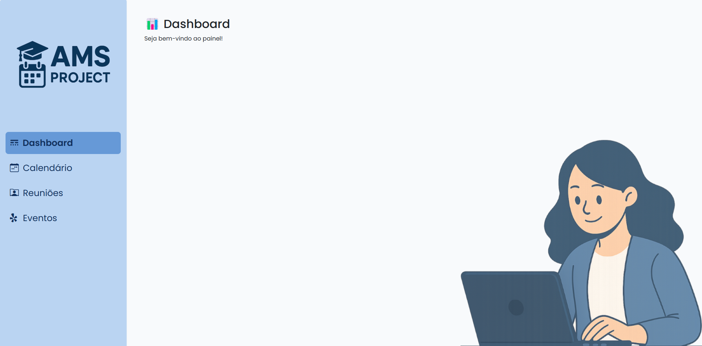

# AMS-Showcase 🎓📊

Versão demonstrativa (genérica) de um sistema web de gestão escolar.  
Este projeto tem fins educacionais e serve como vitrine de layout, estrutura de código e organização de views.

> ⚠️ Este repositório **não** contém dados reais ou informações específicas de instituições de ensino.

---

## ✨ Funcionalidades (em desenvolvimento)

- Interface moderna com layout responsivo
- Navegação dinâmica entre seções
- Dashboard com ilustração e mensagem de boas-vindas
- Estrutura modular com suporte a views parciais

---

## 🛠️ Tecnologias utilizadas

- HTML, CSS e JavaScript
- Bootstrap (UI)
- ASP.NET Core (no projeto real)
- Fetch API para carregamento dinâmico
- Ilustrações em estilo Studio Ghibli 💙

---

## 📂 Estrutura do projeto

📁 wwwroot/ 📁 Views/ 📁 Controllers/ 📁 Scripts/ └─ index.html

---

## 🚧 Em breve

- Tela de login
- Cadastro e gestão de alunos
- Sistema de calendário escolar
- Exportação de dados

---

## 📸 Preview

  
*Imagem ilustrativa da primeira tela do sistema*

---

## 📄 Licença

Este projeto está licenciado sob a **MIT License** — sinta-se livre para usar, estudar e contribuir!

---

## 🤝 Contribuindo

Este projeto é aberto para ideias, sugestões e melhorias.  
Crie uma issue ou um pull request!

---

## 📬 Contato

Se quiser trocar ideia sobre o projeto ou tirar dúvidas:
- Email: [teoalves.dev@gmail.com]
- LinkedIn: [[linkedin.com/in/theusz](https://www.linkedin.com/in/theusz/)

---
Deploy: (https://sistema-gestao-escolar-preview.onrender.com/)
